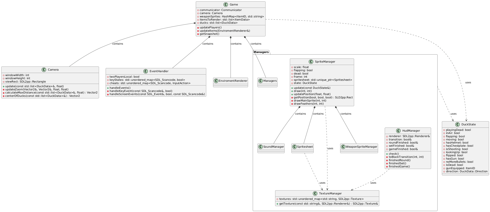

 Documentación técnica

## Formato de archivos y protocolo

El protocolo usado es binario, consta de 4 tipos de mensajes diferentes a enviar, dependiendo de la etapa de la comunicación

**Cliente a Servidor**:
Si el mensaje es desde el lobby se envía en el siguiente orden:

- Un byte Literal 0x0 indicando que es un mensaje de tipo 'Lobby'.

- Un byte Literal indicando el tipo de request: NEWMATCH (0x0), JOINMATCH (0x1), STARTMATCH (0X2).

- Un byte sin signo indicando la cantidad de jugadores (1 o 2 jugadores locales).

- Dos bytes sin signo y en Big Endian para indicar el matchID si es que la request no es de tipo NEWMATCH.

Si el mensaje es desde el cliente gráfico *(SDL)* se envia tal que:

- Primero se envía un byte literal 0x1 indicando que es un mensaje de tipo 'Game'.

- Luego se manda otro byte literal indicando el input presionado, desde 0x0 hasta 0x1E, donde también entran los inputs correspondientes de **cheats** que maneja el cliente.

- Por último se manda otro byte, 1 para indicar que el mensaje lo mando el player 1 y 2 si es del player 2.

**Servidor a Cliente**
Si el mensaje es una respuesta a la request del lobby se envía en el siguiente orden:

- Un byte Literal 0x2 indicando que es una 'Reply'.

- Dos bytes sin signo en Big Endian indicando el matchID, de no ser posible de resolver la request, el matchID pasa a ser 0.

- Un byte sin signo indicando si la partida empezó (1 si empezo, 0 en caso contrario).

- Un byte sin signo indicando la cantidad de jugadores conectados actualmente a la partida.

- Se envían por separado dos bytes sin signo, el primero conteniendo el id del player 1, el otro conteniendo el id del player 2 (si es que hay), que son los utilizados para diferenciar el color del personaje de cada uno.

- Se envía un array de bytes conteniendo el mensaje de error en caso de que el matchID sea 0. Para el caso se envía primero el size del array en dos bytes sin signo en Big Endian, y posteriormente el array de bytes (sin enviar el '/0').

Si el mensaje es un estado del juego actual (Game Status o Snapshot), se envía de forma ordenada:

- Un byte Literal 0x1 indicando que es de tipo 'Game'

- Un byte sin signo indicando si termino la ronda (0 si no termino, 1 en caso contrario).

- Un byte sin signo indicando si termino el set (0 si no termino, 1 en caso contrario).

- Un byte sin signo indicando si termino la partida (0 si no termino, 1 en caso contrario).

- Un byte sin signo indicando el id del fondo de la partida (asociado a una imagen).

- Se envía una serie de Datos asociados a cada jugador:
  * Primero, se envían dos bytes sin signo Big Endian con la cantidad de Duck Data a enviar.
  * Un byte sin signo para el id del player.
  * Un byte sin signo indicando la dirección a la que mira el player,
  * Un byte sin signo representando el arma equipada.
  * A Continuación la cantidad de balas disparadas en el frame actual, es decir primero se debe enviar dos bytes sin signo Big Endian indicando la cantidad de segmentos, y posteriormente enviar cada segmento .
  * Posteriormente se envían dos bytes sin signo Big Endian representando las flags de cada player.
  * Se envía 4 bytes sin signo y Big Endian indicando la cantidad de rondas ganadas por el player.
  * Por último se envía el rectángulo con las dimensiones del player.

- Luego se procede a enviar una lista de ItemData:
  * Se envían dos bytes sin signo Big Endian con para indicar el largo a enviar.
  * Se envía un byte sin signo indicando el id del arma.
  * Se envía el rectángulo asociado a las dimensiones del ítem.

- Por último para los campos con información de bloques, cajas, explosiones y item Spawns se envían de la misma manera:
  * Dos bytes sin signo en Big Endian  indicando cantidad de elementos a enviar.
  * Un rectángulo asociado al dimensión de cada objeto.

- Nota: Cuando se envían Rectángulos o Segmentos no es más que enviar Vectores de dos dimensiones simbolizando las posiciones en el Game:
  * Para el caso de los segmentos, se envía el vector inicio del segmento y el vector fin del segmento.
  * Para el caso de los rectángulos, se envía el vector asociado a la posición y el vector asociado al tamaño del rectángulo
  * Para enviar vectores no es más que enviar 4 bytes sin signo en Big Endian para cada coordenada.