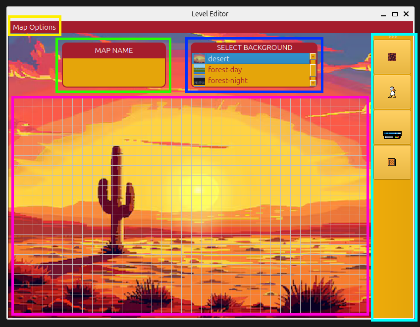

# Manual de usuario

### Versiones y pasos para compilar el proyecto:

El juego es compatible para Linux a partir de Ubuntu 20.04 (Focal Fossa) y superiores.

## Instalación:

1. Instalar git:
    1. $ sudo apt update
    2. $ sudo apt upgrade
    3. $ sudo apt install git

2. Clonar el repositorio:
    1. $ git clone git@github.com:valentinbersi/TP_DuckGame_Grupo08.git
    2. $ cd TP_DuckGame_Grupo08/

3. Correr el script de instalación: $ ./installer.sh. 
   Este script instalará las dependencias necesarias, correrá los tests para comprobar que todo este funcionando
   correctamente e instalará el juego, es
   probable que durante la ejecución la contraseña de sudo sea requerida

#### Ejecución

1. Ejecutar el server: $ DuckGameDedicatedServer [-h] [-c config_directory] [-m maps_directory] port

2. Ejecutar los clients: $ DuckGame [-h] [-r resources_directory] hostname port

3. Ejecutar el editor: $ DuckGameLevelEditor [-h] [-r resources_directory]

## ¿Cómo se levanta el servidor?

Para ejecutar el servidor se debe correr la linea 1. indicada en la sección Ejecución. A continuación se da una
explicación detallada de los argumentos requeridos por el servidos:

1. -h (opcional): de estar presente, el servidor se limitará a mostrar la ayuda y no se ejecutará.

2. -c config_directory (opcional): directorio donde se encuentra el directorio config/ con sus respectivos archivos de
   configuración dentro.
   Si la flag no es pasada como argumento, el servidor buscará el directorio config/ en /etc/DuckGame/.

3. -m maps_directory (opcional): directorio donde se encuentran los mapas que el servidor podrá cargar en las partidas.
   Si la flag no es pasada como argumento, el servidor buscará los mapas en /etc/DuckGame/maps/.

4. port: puerto en el que el servidor escuchará las conexiones de los clientes.

## Manual del servidor

El directorio config debe contar con el siguiente formato:

- config/
    - weapons/
        - ak_47.yaml
        - banana.yaml
        - cowboy_pistol.yaml
        - duel_pistol.yaml
        - grenade.yaml
        - laser_rifle.yaml
        - magnum.yaml
        - pew_pew_laser.yaml
        - shotgun.yaml
        - sniper.yaml
    - armor.yaml
    - duck.yaml
    - match.yaml
    - physics.yaml
    - weapons.yaml

Si el directorio config pasado por argumento no cuenta con esta estructura, el servidor finalizará inmediatamente su
ejecución con un código de error 1 y un mensaje indicando el archivo faltante.

### Formato de los archivos de ejecución

#### weapons/ak_47.yaml

- ammo: [value]
- reach: [value]
- recoil:
    - x: [value]
    - y: [value]
- time between shoots: [value]
- min dispersion: [value]
- mid dispersion: [value]
- max dispersion: [value]

#### weapons/banana.yaml

- ammo: [value]
- reach: [value]

#### weapons/cowboy_pistol.yaml

- ammo: [value]
- reach: [value]
- dispersion: [value]
- recoil:
    - x: [value]
    - y: [value]

#### weapons/duel_pistol.yaml

- ammo: [value]
- reach: [value]
- dispersion: [value]
- recoil:
    - x: [value]
    - y: [value]

#### weapons/grenade.yaml

- ammo: [value]
- reach: [value]
- radius: [value]
- explosion time: [value]

#### weapons/laser_rifle.yaml

- ammo: [value]
- reach: [value]
- dispersion: [value]
- recoil:
    - x: [value]
    - y: [value]
- time between shoots: [value]
- ray angle: [value]
- bounces: [value]

#### weapons/magnum.yaml

- ammo: [value]
- reach: [value]
- dispersion: [value]
- recoil:
    - x: [value]
    - y: [value]

#### weapons/pew_pew_laser.yaml

- ammo: [value]
- dispersion: [value]
- recoil:
    - x: [value]
    - y: [value]
- min_reach: [value]
- max_reach: [value]
- rays per shot: [value]

#### weapons/shotgun.yaml

- ammo: [value]
- dispersion: [value]
- recoil:
    - x: [value]
    - y: [value]
- min reach: [value]
- max reach: [value]
- pellets per shot: [value]
- reload time: [value]

#### weapons/sniper.yaml

- ammo: [value]
- reach: [value]
- dispersion: [value]
- recoil:
    - x: [value]
    - y: [value]
- reload time: [value]

#### armor.yaml

- armor: [value]
- helmet: [value]

#### duck.yaml

- jump time: [value]
- acceleration: [value]
- air acceleration: [value]
- min speed: [value]
- max speed: [value]
- jump speed: [value]
- default hand item: [item name]
- default armor: [true/false]
- default helmet: [true/false]

#### match.yaml

- rounds: [value]
- points to win: [value]

#### physics.yaml

- gravity: [value]

#### weapons.yaml

- min spawn time: [value]
- max spawn time: [value]

En cuanto al campo item name, este puede variar entre las siguientes opciones:

- "grenade"
- "ak-47"
- "duel pistol"
- "cowboy pistol"
- "magnum"
- "shotgun"
- "sniper"
- "helmet"
- "armor"
- "nothing"

Una vez que el servidor se encuentra en ejecución este ejecutará hasta que se le ingrese una q por entrada estandar. En
ese momento, el servidor hará un cierre ordenado, finalizando todas las partidas en ejecución y terminando la conección
con los clientes.

## Manual de Uso del Editor de Niveles

Primero que nada, se debe ejecutar el editor como se indica en el primer apartado de este manual.

Una vez dentro del Editor, se veran claramente en pantalla los 4 elementos claves del programa:

1) Espacio para ingresar el nombre deseado para el mapa
2) Lista de backgrounds otorgados por el editor
3) Barra de herramientas donde se pueden seleccionar los elementos que se pueden agregar al mapa (Plataforma/Tile, Spawn
   de Patos, Spawn de Armas/Armaduras y Cajas)
4) La grilla que representa el mapa como tal

5) Podemos mencionar un quinto elemento que es el menu superior `Map Options`, donde se encuentran las opciones
   `New Map`, `Save Map`, `Edit Map` y `Clear All`

En esta foto se resaltan claramente los 5 elementos mencionados.

#### ¿como agrego elementos al mapa?

Para agregar elementos al mapa, se debe clickear el elemento en la barra de herramientas y luego clickear donde se
quiere agregar el elemento. Se puede clickear una vez, o sino tambien mantener presionado y arrastrar el mouse, asi se
agregaran muchos elementos de forma facil y rapida.

#### ¿como elimino elementos del mapa?

Para eliminar elementos, se debe presionar el click derecho del mouse sobre el elemento que se quiere eliminar, o
tambien se puede mantener apretado y arrastrar el mouse.

#### ¿como me muevo por el mapa?

Para moverse por el mapa, se puede arrastrar la pantalla manteniendo presionado el click izquierdo del mouse, sin tener
seleccionado ningun elemento!

#### ¿como guardo, creo o edito un mapa?

Una vez se tiene el mapa hecho, este se puede guardar seleccionando la opción `Save Map` el menu `Map Options` o bien
presionando `CTRL+S`

Como ya se menciono, en el menu `Map Options` tambien se ofrecen las opciones de `New Map` para crear un nuevo mapa (o
`CTRL+N`) o `Edit Map` para editar un mapa ya creado (o `CTRL+E`). Otra funcionalidad que se ofrece es la de
`Clear All`, que elimina todos los elementos del mapa.

Se recomienda guardar los mapas en la carpeta `/etc/DuckGame/maps`, para que el server pueda cargar los mapas y
mostrarlos en el juego.
Esta carpeta se genera al momento de la instalación del juego.
El server lee por default desde esta carpeta, pero usted puede modificar esto (para mas precisión leer el apartado del
manual del server)

### Controles del Editor:

* Seleccionar/Deseleccionar objeto para agregar: Se selecciona en la barra lateral derecha.
* Agregar objeto seleccionado al mapa: Click izquierdo
* Eliminar objeto del mapa: Click derecho
* Nuevo Mapa: `CTRL+N`
* Guardar Mapa: `CTRL+S`
* Cargar/Editar Mapa: `CTRL+E`

## Manual de Uso del Lobby

Una vez ejecutado el cliente (como se indica en el apartado de Instalacion) se ejecutara la aplicacion del Lobby del
juego.  
Lo primero que se vera un menú donde hay dos opciones bien claras: `Play` para avanzar a jugar y `Exit`para salir.  
Al presionar `Play`, se mostrara una nueva pantalla, donde se debe seleccionar cuantos jugadores locales jugaran (1 o 2)
y si se quiere crear o unirse a una partida.  
Si el usuario decide crear una partida, se comunicara con el servidor y se conectara a la Lobby de la partida, donde
debera iniciar la partida cuando lo desee.  
Si quiere unirse a una partida, debera ingresar un MatchID válido (de una partida que no este iniciada) y ahi pasara a
la lobby, donde esperara a que el host de la partida de inicio a la misma.  
Si el matchID es invalido o la partida ya comenzo, se le informara al usuario para que decida como proceder.  
Una vez que el host inicia la partida, a todos los jugadores que esten en ese momento conectados a la partida se les
cerrara la aplicacion del Lobby y se abrira el juego DuckGame.  
En el siguiente apartado se habla sobre las funcionalidades y jugabilidad del juego.

## Dinámica del Juego

La jugabilidad es simple: El juego consta de diversas rondas donde los jugadores batallaran entre sí con diversas armas
tomadas del mapa. Las rondas se complementan con **sets**, los cuales duran 5 rondas.
Cada finalización de **set** mostrará la cantidad de rondas ganadas por cada jugador, y el que llegue primero a las 10
rondas será el ganador.
Cada jugador aguantará por default un solo ataque, independientemente del arma que sea. Por eso mismo, el gameplay se
volverá lo más frenético posible.

*Además, el jugador puede*:

* Hacerse el muerto
* Aumentar la altura del salto manteniendo presionada la tecla
* Moverse hacia los lados y 'aletear' en el aire presionando repetidas veces la tecla de salto
* Tomar armas y diversas armaduras para usarlas

Cada pieza de armadura (sea un helmet o chestplate) amortiguará **1** ataque extra recibido

### Controles del Juego:

* F11 para fullscreen

#### Jugador 1:

* Movimiento: `WASD`
* Salto: `SPACE`
* Interactuar: `E`
* Disparo: `G`

#### Jugador 2:

* Movimiento: Flechas de dirección (`←` `↑` `↓` `→`)
* Salto: `COMMA`
* Interactuar: `PERIOD` (or dot)           (Las tres teclas juntas, justo al lado del LSHIFT)
* Disparo: `SLASH`

## Controles del Editor:

* Seleccionar/Deseleccionar objeto para agregar: Se selecciona en la barra lateral derecha.
* Agregar objeto seleccionado al mapa: Click izquierdo
* Eliminar objeto del mapa: Click derecho
* Nuevo Mapa: `CTRL+N`
* Guardar Mapa: `CTRL+S`
* Cargar/Editar Mapa: `CTRL+E`
